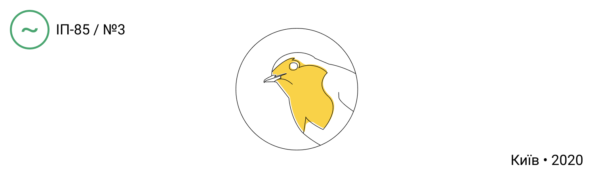

<p align="center">
  <a href="https://getrobin.now.sh/" target="blank"></a>
</p>

<p align="center">
 	ROBIN opendata management system
</p>

## Installation

```bash
$ yarn install
```

## Running the app

```bash
# development
$ yarn  start

# watch mode
$ yarn start:dev

# production mode
$ yarn start:prod
```

## Test

```bash
# unit tests
$ yarn test

# e2e tests
$ yarn test:e2e

# test coverage
$ yarn test:cov
```

## Support

ROBIN is an MIT-licensed open source project. It can grow thanks to the sponsors and support by the amazing backers. If you'd like to join them, please [read more here](https://getrobin.now.sh/support).

## Stay in touch

- Authors:
  - Лепейко Евген Володимирович [lepeicobb@gmail.com](mailto:lepeicobb@gmail.com)
  - Черевач Анатолій Миколайович [anatoliycherevach@gmail.com](mailto:anatoliycherevach@gmail.com)
  - Лукашук Никита Сергеевич [nikitalukash56@gmail.com](mailto:nikitalukash56@gmail.com)
  - Стародубець Ілля Стародубець [mrqillp@gmail.com](mailto:mrqillp@gmail.com)
  - Васильев Георгий Зиновьевич [georgevasilyev2000@gmail.com](mailto:georgevasilyev2000@gmail.com)
- Website - [getrobin.now.sh](https://getrobin.now.sh/)

## License

  ROBIN is [MIT licensed](LICENSE).
